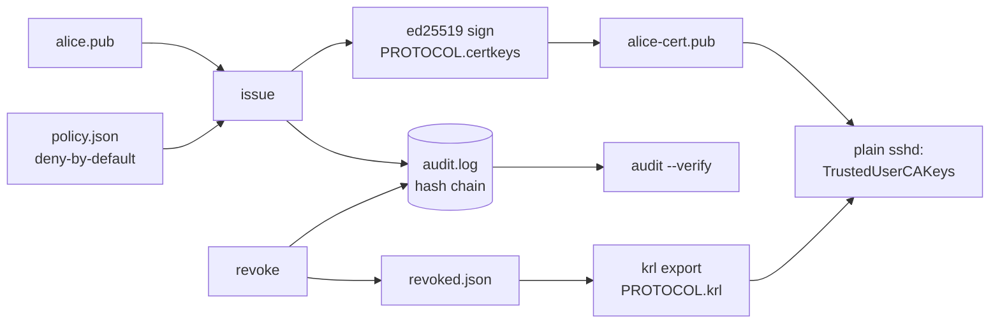

# certclerk

[English](README.md) | [中文](README.zh.md) | [日本語](README.ja.md)

[](LICENSE) [](go.mod) [](CHANGELOG.md)  [](CONTRIBUTING.md)

**certclerk：小さなオープンソース SSH 認証局——短命ユーザー証明書、principal ポリシー、失効、改ざん検知できる監査ログを、すでに動いている OpenSSH のままで。**


```bash
git clone https://github.com/JaydenCJ/certclerk && cd certclerk
go build -o certclerk ./cmd/certclerk    # single static binary, stdlib only
```

> プレリリース：v0.1.0 はまだどのレジストリにも公開していません。上記の通りソースからビルドしてください（Go ≥1.22）。

## なぜ certclerk？

多くのサーバー群はいまだに静的な `authorized_keys` で SSH を管理していますが、これは既知の侵害経路です：鍵は何年も溜まり、どの行が誰のものか誰にも分からず、退職処理は全ホストで grep する作業になります。OpenSSH は 5.4 から解決策——`TrustedUserCAKeys` 一行で信頼するユーザー証明書——を備えているのに、ツールの空白が静的鍵に人々を留めています：Teleport の類はプロキシ・エージェント・クラスタで SSH スタックごと置き換えて解決し、素の `ssh-keygen -s` は署名だけでポリシーも失効も署名記録もありません。certclerk は欠けていた CA そのものです：標準ライブラリのみの単一バイナリが、デフォルト拒否の principal ポリシー（ユーザー別許可リスト、TTL 上限、送信元アドレス固定、強制コマンド）の下で短命証明書を発行し、シリアルまたは key ID で失効させて `sshd` が実際に読むバイナリ KRL 形式へ書き出し、すべての発行をハッシュ連鎖の監査ログに記録して改ざんを検知可能にします。ホストは素の OpenSSH のまま。導入は午後ひとつ、撤去は sshd_config の 2 行を消すだけです。

| | certclerk | Teleport | Vault SSH エンジン | ssh-keygen -s |
|---|---|---|---|---|
| 短命ユーザー証明書 | ✅ | ✅ | ✅ | ✅ 手動 |
| principal ポリシー（ユーザー別許可リスト、TTL 上限） | ✅ デフォルト拒否 | ✅ | ⚠️ ロールテンプレート | ❌ |
| sshd ネイティブ KRL での失効 | ✅ バイナリ KRL | ⚠️ 独自プロキシ層 | ❌ | ⚠️ 手動で `-k` |
| 改ざん検知できる監査ログ | ✅ ハッシュ連鎖 | ✅ | ⚠️ サーバーログ | ❌ |
| ホスト側に必要なもの | 素の OpenSSH | エージェント + プロキシ | Vault サーバー | 素の OpenSSH |
| 実行時フットプリント | 静的バイナリ 1 個、デーモンなし | クラスタ一式 | Vault + ストレージ | — |
| ランタイム依存 | 0（Go 標準ライブラリ） | 多数 | 多数 | OpenSSH |

<sub>2026-07-13 確認：certclerk は Go 標準ライブラリのみを import。Teleport は最小構成でも proxy+auth サービスが動き、Vault の SSH エンジンはストレージバックエンド付きの稼働中 Vault を要求します。</sub>

## 特徴

- **ゼロから実装した本物の OpenSSH 証明書**——PROTOCOL.certkeys を標準ライブラリで実装：ed25519 署名の `*-cert-v01@openssh.com` blob、オプションはソート済み、ed25519/RSA/ECDSA/sk-* のユーザー鍵を証明可能；`ssh-keygen -L` が読め、`sshd` が受理します。
- **デフォルト拒否の principal ポリシー**——`policy.json` がユーザーを許可 principal、TTL 上限、拡張、送信元アドレス固定、強制コマンドへ対応付け；未知フィールド・不正 CIDR・タイポは即エラー、載っていないユーザーには何も出ません。
- **短命であることが構造的**——`30m` のような TTL はポリシー上限（フォールバック 8h）で制限され、既定 60 秒のバックデートで発行直後の証明書がホストの時刻ずれに耐えます。
- **sshd が本当に強制する失効**——`revoke --serial`/`--key-id` が `krl` に流れ、`RevokedKeys` ディレクティブ用の OpenSSH バイナリ KRL を出力；シリアルは監査ログと突き合わせるので、存在しない証明書の失効はエラーになります。
- **改ざん検知できる監査ログ**——init/issue/revoke のたびにハッシュ連鎖の JSONL を追記；`audit --verify` が書き換え・削除・並べ替えを検出し、最初の不正エントリを名指しします。
- **依存ゼロ・完全オフライン**——Go 標準ライブラリのみ、静的バイナリ 1 個、デーモンなし、ネットワークアクセスなし、テレメトリなし；CA 全体がただのファイル群で `cp -r` でバックアップできます。

## クイックスタート

```bash
certclerk init                     # CA keypair + policy.json + audit log in ./.certclerk
$EDITOR .certclerk/policy.json     # grant alice her principals (see docs/policy.md)
certclerk issue --user alice --key alice.pub --ttl 30m
certclerk verify alice-cert.pub
```

実際に取得した出力：

```text
issued serial 1 to alice: principals alice,deploy, valid 30m (until 2026-07-13T06:22:01Z)
wrote alice-cert.pub
OK: serial 1 key id "alice@certclerk-1" principals alice,deploy valid until 2026-07-13T06:22:01Z
```

ポリシーにない要求は CA が拒否します（終了コード 1、シリアルは消費しない）：

```text
certclerk: policy: denied for "alice": principal "root" is not allowed
```

証明書を失効させると連鎖全体が反応します——verify は失敗し、KRL は増え、監査ログが記憶します：

```text
$ certclerk revoke --serial 1 --reason "laptop stolen"
revoked serial 1
re-export the KRL and redistribute it: certclerk krl --out revoked.krl
$ certclerk verify alice-cert.pub
certclerk: verify alice-cert.pub: ca: certificate revoked (serial 1 at 2026-07-13T05:52:01Z)
$ certclerk audit
#1 2026-07-13T05:52:01Z init   fp=SHA256:wbKFrLxJaStAX23qfVXzuexMG9aMc/ItF54L0+1e8/o
#2 2026-07-13T05:52:01Z issue  user=alice serial=1 key_id="alice@certclerk-1" principals=alice,deploy until=2026-07-13T06:22:01Z fp=SHA256:yQsBpjfE2voM6jBRVYFQ9vlGKXv2w81FRiB4lfkMVEE
#3 2026-07-13T05:52:01Z revoke user=alice serial=1 key_id="alice@certclerk-1" reason="laptop stolen"
```

## ホストへの配備

ホスト側の変更はこの sshd_config 2 行だけ。`certclerk setup` があなたの CA 公開鍵を埋めた注釈付きの完全なスニペットを出力します。ホストごとに一度だけ：

```text
TrustedUserCAKeys /etc/ssh/certclerk-ca.pub      # the CA *public* key, never ca.key
RevokedKeys /etc/ssh/certclerk-revoked.krl       # re-copy after every revoke
```

以後ユーザーは鍵と証明書で接続します——どこにも `authorized_keys` エントリは不要です：

```bash
ssh -i id_ed25519 -o CertificateFile=id_ed25519-cert.pub deploy@app-01.example.test
```

## CLI リファレンス

`certclerk [init|issue|verify|inspect|revoke|krl|policy|audit|setup|version]`——終了コード：0 正常、1 拒否/無効/破損、2 使い方エラー、3 実行時エラー。CA ディレクトリは `--dir`、`$CERTCLERK_DIR`、`./.certclerk` の順で解決されます。

| フラグ | 既定値 | 効果 |
|---|---|---|
| `--user`（issue） | — | 証明書を要求するユーザー；ポリシーに存在必須 |
| `--key`（issue） | — | ユーザーの公開鍵（`.pub` ファイル） |
| `--principals`（issue） | ポリシーが許す全部 | カンマ区切りで要求するサブセット |
| `--ttl`（issue） | ポリシーの `max_ttl` | 要求する有効期間（`30m`、`2h`、`1d`） |
| `--backdate`（issue） | `60s` | 時刻ずれ吸収のため ValidAfter を過去へずらす |
| `--key-id`（issue） | `<user>@certclerk-<serial>` | 証明書の key ID |
| `--out`（issue/krl） | `<key>-cert.pub` / stdout | 出力先（`-` = stdout） |
| `--at`（verify） | 現在時刻 | RFC 3339 の時点指定チェック |
| `--serial` / `--key-id`（revoke） | — | どちらか一方：証明書 1 枚、または key ID 配下の全証明書を失効 |
| `--verify`（audit） | オフ | エントリ表示の代わりにハッシュ連鎖を検証 |
| `--format`（inspect/audit） | `text` | `text` または `json` |

ポリシーの意味論（ワイルドカード、継承、critical options）：[docs/policy.md](docs/policy.md)。実行できるデモ：[examples/](examples/README.md)。

## 検証

このリポジトリは CI を同梱しません。上記の主張はすべてローカル実行で検証されています：

```bash
go test ./...            # 90 deterministic tests, offline, < 5 s
bash scripts/smoke.sh    # end-to-end lifecycle check, prints SMOKE OK
```

OpenSSH がインストールされていれば、smoke スクリプトは発行した証明書と書き出した KRL を `ssh-keygen` 本体でも相互検証します。

## アーキテクチャ



## ロードマップ

- [x] v0.1.0——標準ライブラリ製 OpenSSH 証明書エンジン、デフォルト拒否 principal ポリシー、シリアル/key ID 失効とバイナリ KRL 出力、ハッシュ連鎖監査ログ、verify/inspect/setup ツール、90 テスト + smoke スクリプト
- [ ] `certclerk serve`——CI が CA のファイルシステムに触れずに証明書を要求できる、任意の loopback HTTP エンドポイント
- [ ] ホスト証明書（`-h`）で、マシン側もユーザーへ身元を証明
- [ ] KRL のシリアル区間圧縮と、外部 KRL 向けの `krl inspect`
- [ ] ポリシー条件：時間帯ウィンドウ、ワイルドカード許可への理由必須化
- [ ] CA 秘密鍵の保存時暗号化（パスフレーズ / OS キーチェーン）

全リストは [open issues](https://github.com/JaydenCJ/certclerk/issues) を参照してください。

## コントリビュート

Issue・ディスカッション・PR を歓迎します——ローカルの手順（フォーマット、vet、テスト、`SMOKE OK`）は [CONTRIBUTING.md](CONTRIBUTING.md) へ。入門しやすい課題は [good first issue](https://github.com/JaydenCJ/certclerk/issues?q=is%3Aissue+is%3Aopen+label%3A%22good+first+issue%22)、設計の議論は [Discussions](https://github.com/JaydenCJ/certclerk/discussions) にあります。

## ライセンス

[MIT](LICENSE)
