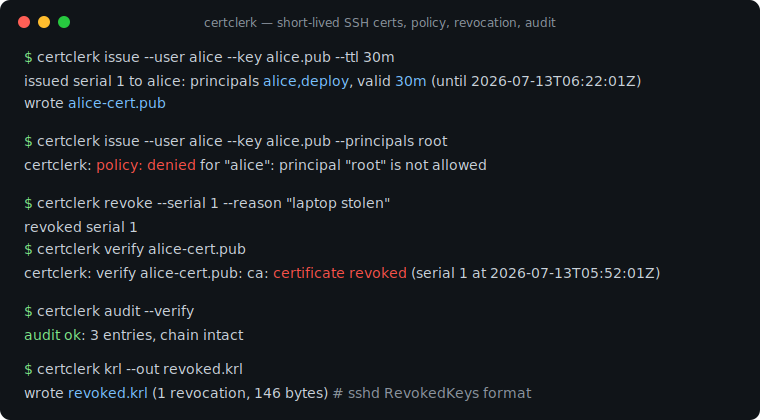
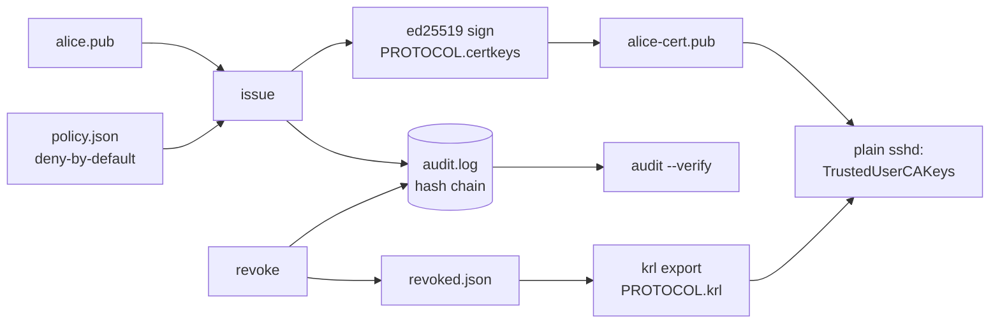

# certclerk

[English](README.md) | [中文](README.zh.md) | [日本語](README.ja.md)

[](LICENSE) [](go.mod) [](CHANGELOG.md)  [](CONTRIBUTING.md)

**certclerk：a tiny open-source SSH certificate authority — short-lived user certs, principal policies, revocation, and a tamper-evident audit log, working with the OpenSSH you already run.**



```bash
git clone https://github.com/JaydenCJ/certclerk && cd certclerk
go build -o certclerk ./cmd/certclerk    # single static binary, stdlib only
```

> Pre-release: v0.1.0 is not tagged on a package registry yet; build from source as above (any Go ≥1.22).

## Why certclerk?

Static `authorized_keys` files are how most fleets still do SSH, and they are a known breach vector: keys accumulate for years, nobody knows which line belongs to whom, and offboarding means grepping every host. OpenSSH has shipped the fix since 5.4 — user certificates trusted via one `TrustedUserCAKeys` line — but the tooling gap keeps people on static keys: Teleport and friends solve it by replacing your whole SSH stack with proxies, agents, and a cluster, while raw `ssh-keygen -s` gives you signatures with no policy, no revocation story, and no record of what was signed. certclerk is just the missing CA: one stdlib-only binary that issues short-lived certificates under a deny-by-default principal policy (per-user allowlists, TTL caps, source-address pins, forced commands), revokes by serial or key ID into the real binary KRL format `sshd` consumes, and writes every issuance into a hash-chained audit log where tampering is detectable. Hosts keep running plain OpenSSH; adopting it is an afternoon, and un-adopting it is deleting two lines of sshd_config.

| | certclerk | Teleport | Vault SSH engine | ssh-keygen -s |
|---|---|---|---|---|
| Short-lived user certificates | ✅ | ✅ | ✅ | ✅ manual |
| Principal policy (per-user allowlists, TTL caps) | ✅ deny-by-default | ✅ | ⚠️ role templates | ❌ |
| Revocation as an sshd-native KRL | ✅ binary KRL | ⚠️ own proxy layer | ❌ | ⚠️ hand-run `-k` |
| Tamper-evident audit log | ✅ hash chain | ✅ | ⚠️ server logs | ❌ |
| Hosts need | plain OpenSSH | agents + proxy | Vault server | plain OpenSSH |
| Runtime footprint | 1 static binary, no daemon | cluster of services | Vault + storage | — |
| Runtime dependencies | 0 (Go stdlib) | many | many | OpenSSH |

<sub>Checked 2026-07-13: certclerk imports the Go standard library only; Teleport's minimal deployment runs proxy+auth services; Vault's SSH engine requires a running Vault with a storage backend.</sub>

## Features

- **Real OpenSSH certificates, from scratch** — implements PROTOCOL.certkeys on the stdlib: ed25519-signed `*-cert-v01@openssh.com` blobs with sorted options, certifying ed25519/RSA/ECDSA/sk-* user keys; `ssh-keygen -L` reads them and `sshd` accepts them.
- **Deny-by-default principal policy** — `policy.json` maps users to allowed principals, TTL caps, extensions, source-address pins, and forced commands; unknown fields, bad CIDRs, and typos are hard errors, and an unlisted user gets nothing.
- **Short-lived by construction** — TTLs like `30m` with a policy-enforced cap (fallback 8h), plus a default 60s backdate so freshly issued certs survive host clock skew.
- **Revocation sshd actually enforces** — `revoke --serial`/`--key-id` feeds `krl`, which emits OpenSSH's binary KRL for the `RevokedKeys` directive; serials are validated against the audit log so a typo cannot revoke thin air.
- **Tamper-evident audit log** — every init/issue/revoke appends a hash-chained JSONL entry; `audit --verify` detects rewritten, deleted, or reordered history and names the first bad entry.
- **Zero dependencies, fully offline** — Go standard library only, one static binary, no daemon, no network calls, no telemetry; the whole CA is plain files you can back up with `cp -r`.

## Quickstart

```bash
certclerk init                     # CA keypair + policy.json + audit log in ./.certclerk
$EDITOR .certclerk/policy.json     # grant alice her principals (see docs/policy.md)
certclerk issue --user alice --key alice.pub --ttl 30m
certclerk verify alice-cert.pub
```

Real captured output:

```text
issued serial 1 to alice: principals alice,deploy, valid 30m (until 2026-07-13T06:22:01Z)
wrote alice-cert.pub
OK: serial 1 key id "alice@certclerk-1" principals alice,deploy valid until 2026-07-13T06:22:01Z
```

Ask for something the policy does not grant and the CA refuses (exit 1, no serial burned):

```text
certclerk: policy: denied for "alice": principal "root" is not allowed
```

Revoke the cert and the whole chain reacts — verify fails, the KRL grows, the audit log remembers:

```text
$ certclerk revoke --serial 1 --reason "laptop stolen"
revoked serial 1
re-export the KRL and redistribute it: certclerk krl --out revoked.krl
$ certclerk verify alice-cert.pub
certclerk: verify alice-cert.pub: ca: certificate revoked (serial 1 at 2026-07-13T05:52:01Z)
$ certclerk audit
#1 2026-07-13T05:52:01Z init   fp=SHA256:wbKFrLxJaStAX23qfVXzuexMG9aMc/ItF54L0+1e8/o
#2 2026-07-13T05:52:01Z issue  user=alice serial=1 key_id="alice@certclerk-1" principals=alice,deploy until=2026-07-13T06:22:01Z fp=SHA256:yQsBpjfE2voM6jBRVYFQ9vlGKXv2w81FRiB4lfkMVEE
#3 2026-07-13T05:52:01Z revoke user=alice serial=1 key_id="alice@certclerk-1" reason="laptop stolen"
```

## Deploy to your hosts

The whole host-side change is these two sshd_config lines; `certclerk setup` prints the full commented snippet with your CA key filled in. One-time, per host:

```text
TrustedUserCAKeys /etc/ssh/certclerk-ca.pub      # the CA *public* key, never ca.key
RevokedKeys /etc/ssh/certclerk-revoked.krl       # re-copy after every revoke
```

Users then connect with their key plus the certificate — no `authorized_keys` entry anywhere:

```bash
ssh -i id_ed25519 -o CertificateFile=id_ed25519-cert.pub deploy@app-01.example.test
```

## CLI reference

`certclerk [init|issue|verify|inspect|revoke|krl|policy|audit|setup|version]` — exit codes: 0 ok, 1 denied/invalid/broken, 2 usage error, 3 runtime error. The CA directory resolves from `--dir`, then `$CERTCLERK_DIR`, then `./.certclerk`.

| Flag | Default | Effect |
|---|---|---|
| `--user` (issue) | — | requesting user; must exist in the policy |
| `--key` (issue) | — | the user's public key (`.pub` file) |
| `--principals` (issue) | all the policy grants | comma-separated subset to request |
| `--ttl` (issue) | the policy's `max_ttl` | requested lifetime (`30m`, `2h`, `1d`) |
| `--backdate` (issue) | `60s` | shift ValidAfter into the past for clock skew |
| `--key-id` (issue) | `<user>@certclerk-<serial>` | certificate key ID |
| `--out` (issue/krl) | `<key>-cert.pub` / stdout | output path (`-` = stdout) |
| `--at` (verify) | now | point-in-time check, RFC 3339 |
| `--serial` / `--key-id` (revoke) | — | exactly one: revoke one cert, or every cert under a key ID |
| `--verify` (audit) | off | check the hash chain instead of printing entries |
| `--format` (inspect/audit) | `text` | `text` or `json` |

Policy semantics (wildcards, inheritance, critical options): [docs/policy.md](docs/policy.md). Runnable demos: [examples/](examples/README.md).

## Verification

This repository ships no CI; every claim above is verified by local runs:

```bash
go test ./...            # 90 deterministic tests, offline, < 5 s
bash scripts/smoke.sh    # end-to-end lifecycle check, prints SMOKE OK
```

The smoke script also cross-checks the issued certificate and the exported KRL against `ssh-keygen` itself when OpenSSH is installed.

## Architecture



## Roadmap

- [x] v0.1.0 — stdlib OpenSSH cert engine, deny-by-default principal policy, serial/key-ID revocation with binary KRL export, hash-chained audit log, verify/inspect/setup tooling, 90 tests + smoke script
- [ ] `certclerk serve` — optional loopback HTTP endpoint so CI can request certs without filesystem access to the CA
- [ ] Host certificates (`-h`) so machines can prove themselves to users too
- [ ] KRL serial-range compression and `krl inspect` for foreign KRLs
- [ ] Policy conditions: time-of-day windows and required reasons for wildcard grants
- [ ] Encrypted CA key at rest (passphrase / OS keychain)

See the [open issues](https://github.com/JaydenCJ/certclerk/issues) for the full list.

## Contributing

Issues, discussions and pull requests are welcome — see [CONTRIBUTING.md](CONTRIBUTING.md) for the local workflow (format, vet, tests, `SMOKE OK`). Good entry points are labelled [good first issue](https://github.com/JaydenCJ/certclerk/issues?q=is%3Aissue+is%3Aopen+label%3A%22good+first+issue%22), and design questions live in [Discussions](https://github.com/JaydenCJ/certclerk/discussions).

## License

[MIT](LICENSE)
