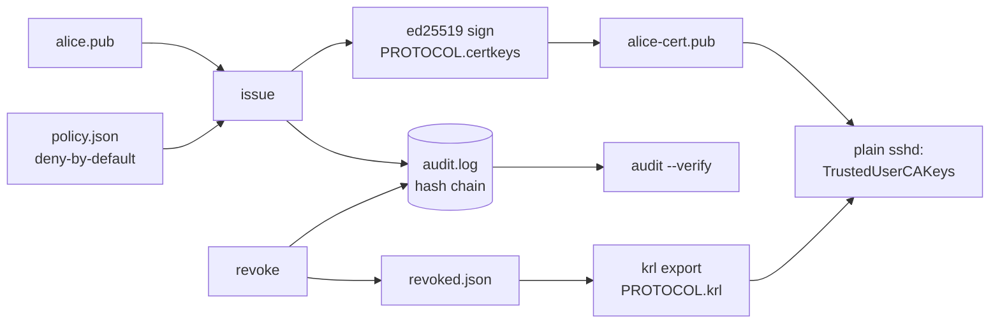

# certclerk

[English](README.md) | [中文](README.zh.md) | [日本語](README.ja.md)

[](LICENSE) [](go.mod) [](CHANGELOG.md)  [](CONTRIBUTING.md)

**certclerk：一个微型的开源 SSH 证书颁发机构——短时效用户证书、principal 策略、吊销、防篡改审计日志，与你已经在运行的 OpenSSH 直接配合。**


```bash
git clone https://github.com/JaydenCJ/certclerk && cd certclerk
go build -o certclerk ./cmd/certclerk    # single static binary, stdlib only
```

> 预发布：v0.1.0 尚未发布到任何包仓库；请按上述方式从源码构建（任意 Go ≥1.22）。

## 为什么选 certclerk？

大多数服务器集群至今仍靠静态 `authorized_keys` 管 SSH，而它是众所周知的入侵入口：公钥一堆就是好几年，没人说得清哪一行属于谁，员工离职意味着到每台主机上 grep。OpenSSH 从 5.4 起就自带了解药——通过一行 `TrustedUserCAKeys` 信任用户证书——但工具链的缺口让大家留在静态公钥上：Teleport 之类的方案用代理、agent 和集群替换你的整个 SSH 栈来解决问题，而裸的 `ssh-keygen -s` 只给你签名，没有策略、没有吊销机制、也没有签发记录。certclerk 就只是那个缺失的 CA：一个纯标准库的二进制，在默认拒绝的 principal 策略（按用户的白名单、TTL 上限、来源地址钉定、强制命令）下签发短时效证书，按序列号或 key ID 吊销并导出 `sshd` 真正消费的二进制 KRL 格式，每次签发都写入哈希链审计日志、篡改可被检出。主机继续跑原生 OpenSSH；采用它只要一个下午，弃用它只是删掉 sshd_config 里的两行。

| | certclerk | Teleport | Vault SSH 引擎 | ssh-keygen -s |
|---|---|---|---|---|
| 短时效用户证书 | ✅ | ✅ | ✅ | ✅ 手动 |
| principal 策略（按用户白名单、TTL 上限） | ✅ 默认拒绝 | ✅ | ⚠️ 角色模板 | ❌ |
| 以 sshd 原生 KRL 做吊销 | ✅ 二进制 KRL | ⚠️ 自有代理层 | ❌ | ⚠️ 手动跑 `-k` |
| 防篡改审计日志 | ✅ 哈希链 | ✅ | ⚠️ 服务器日志 | ❌ |
| 主机侧需要 | 原生 OpenSSH | agent + 代理 | Vault 服务器 | 原生 OpenSSH |
| 运行时体量 | 1 个静态二进制，无守护进程 | 一组集群服务 | Vault + 存储 | — |
| 运行时依赖 | 0（Go 标准库） | 很多 | 很多 | OpenSSH |

<sub>核查于 2026-07-13：certclerk 仅导入 Go 标准库；Teleport 的最小部署也要运行 proxy+auth 服务；Vault 的 SSH 引擎需要带存储后端的运行中 Vault。</sub>

## 特性

- **从零实现的真 OpenSSH 证书**——用标准库实现 PROTOCOL.certkeys：ed25519 签名的 `*-cert-v01@openssh.com` blob、选项按序编码，可为 ed25519/RSA/ECDSA/sk-* 用户密钥签发；`ssh-keygen -L` 能读、`sshd` 能收。
- **默认拒绝的 principal 策略**——`policy.json` 把用户映射到允许的 principal、TTL 上限、扩展、来源地址钉定和强制命令；未知字段、坏 CIDR、手误都是硬错误，不在名单上的用户什么也拿不到。
- **短时效是构造出来的**——`30m` 这类 TTL 受策略上限约束（兜底 8h），另有默认 60 秒回拨，让刚签发的证书扛得住主机时钟偏差。
- **sshd 真会执行的吊销**——`revoke --serial`/`--key-id` 喂给 `krl`，输出 OpenSSH 的二进制 KRL 供 `RevokedKeys` 指令使用；序列号会对照审计日志校验，手滑吊销不存在的证书直接报错。
- **防篡改审计日志**——每次 init/issue/revoke 都追加一条哈希链 JSONL 记录；`audit --verify` 能检出被改写、删除、重排的历史并指出第一条坏记录。
- **零依赖、完全离线**——仅 Go 标准库，一个静态二进制，无守护进程、无网络调用、无遥测；整个 CA 就是一堆普通文件，`cp -r` 即可备份。

## 快速上手

```bash
certclerk init                     # CA keypair + policy.json + audit log in ./.certclerk
$EDITOR .certclerk/policy.json     # grant alice her principals (see docs/policy.md)
certclerk issue --user alice --key alice.pub --ttl 30m
certclerk verify alice-cert.pub
```

真实抓取的输出：

```text
issued serial 1 to alice: principals alice,deploy, valid 30m (until 2026-07-13T06:22:01Z)
wrote alice-cert.pub
OK: serial 1 key id "alice@certclerk-1" principals alice,deploy valid until 2026-07-13T06:22:01Z
```

请求策略没有授予的东西，CA 会拒绝（退出码 1，不消耗序列号）：

```text
certclerk: policy: denied for "alice": principal "root" is not allowed
```

吊销证书后整条链都会反应——verify 失败、KRL 变大、审计日志留痕：

```text
$ certclerk revoke --serial 1 --reason "laptop stolen"
revoked serial 1
re-export the KRL and redistribute it: certclerk krl --out revoked.krl
$ certclerk verify alice-cert.pub
certclerk: verify alice-cert.pub: ca: certificate revoked (serial 1 at 2026-07-13T05:52:01Z)
$ certclerk audit
#1 2026-07-13T05:52:01Z init   fp=SHA256:wbKFrLxJaStAX23qfVXzuexMG9aMc/ItF54L0+1e8/o
#2 2026-07-13T05:52:01Z issue  user=alice serial=1 key_id="alice@certclerk-1" principals=alice,deploy until=2026-07-13T06:22:01Z fp=SHA256:yQsBpjfE2voM6jBRVYFQ9vlGKXv2w81FRiB4lfkMVEE
#3 2026-07-13T05:52:01Z revoke user=alice serial=1 key_id="alice@certclerk-1" reason="laptop stolen"
```

## 部署到主机

主机侧的全部改动就是这两行 sshd_config；`certclerk setup` 会打印带注释的完整片段，并填入你的 CA 公钥。每台主机一次性配置：

```text
TrustedUserCAKeys /etc/ssh/certclerk-ca.pub      # the CA *public* key, never ca.key
RevokedKeys /etc/ssh/certclerk-revoked.krl       # re-copy after every revoke
```

之后用户带着私钥加证书连接——任何地方都不再需要 `authorized_keys` 条目：

```bash
ssh -i id_ed25519 -o CertificateFile=id_ed25519-cert.pub deploy@app-01.example.test
```

## CLI 参考

`certclerk [init|issue|verify|inspect|revoke|krl|policy|audit|setup|version]`——退出码：0 正常，1 被拒/无效/损坏，2 用法错误，3 运行时错误。CA 目录按 `--dir`、`$CERTCLERK_DIR`、`./.certclerk` 的顺序解析。

| 标志 | 默认值 | 作用 |
|---|---|---|
| `--user`（issue） | — | 请求证书的用户；必须存在于策略中 |
| `--key`（issue） | — | 用户的公钥（`.pub` 文件） |
| `--principals`（issue） | 策略授予的全部 | 逗号分隔的请求子集 |
| `--ttl`（issue） | 策略的 `max_ttl` | 请求的有效期（`30m`、`2h`、`1d`） |
| `--backdate`（issue） | `60s` | 将 ValidAfter 前移以吸收时钟偏差 |
| `--key-id`（issue） | `<user>@certclerk-<serial>` | 证书 key ID |
| `--out`（issue/krl） | `<key>-cert.pub` / stdout | 输出路径（`-` = stdout） |
| `--at`（verify） | 当前时间 | 按 RFC 3339 时间点校验 |
| `--serial` / `--key-id`（revoke） | — | 二选一：吊销单张证书，或该 key ID 下的所有证书 |
| `--verify`（audit） | 关 | 校验哈希链而不是打印记录 |
| `--format`（inspect/audit） | `text` | `text` 或 `json` |

策略语义（通配符、继承、critical options）：[docs/policy.md](docs/policy.md)。可运行的演示：[examples/](examples/README.md)。

## 验证

本仓库不带 CI；上面的每一条断言都由本地运行验证：

```bash
go test ./...            # 90 deterministic tests, offline, < 5 s
bash scripts/smoke.sh    # end-to-end lifecycle check, prints SMOKE OK
```

装有 OpenSSH 时，smoke 脚本还会用 `ssh-keygen` 本尊交叉校验签出的证书与导出的 KRL。

## 架构



## 路线图

- [x] v0.1.0——标准库 OpenSSH 证书引擎、默认拒绝的 principal 策略、按序列号/key ID 吊销并导出二进制 KRL、哈希链审计日志、verify/inspect/setup 工具、90 个测试 + smoke 脚本
- [ ] `certclerk serve`——可选的 loopback HTTP 端点，让 CI 无需访问 CA 文件系统即可请求证书
- [ ] 主机证书（`-h`），让机器也能向用户自证身份
- [ ] KRL 序列号区间压缩，以及针对外部 KRL 的 `krl inspect`
- [ ] 策略条件：时间窗口，以及通配符授权的必填理由
- [ ] CA 私钥静态加密（口令 / 系统钥匙串）

完整列表见 [open issues](https://github.com/JaydenCJ/certclerk/issues)。

## 参与贡献

欢迎 issue、讨论与 PR——本地流程（格式化、vet、测试、`SMOKE OK`）见 [CONTRIBUTING.md](CONTRIBUTING.md)。入门任务标记为 [good first issue](https://github.com/JaydenCJ/certclerk/issues?q=is%3Aissue+is%3Aopen+label%3A%22good+first+issue%22)，设计讨论在 [Discussions](https://github.com/JaydenCJ/certclerk/discussions)。

## 许可证

[MIT](LICENSE)
